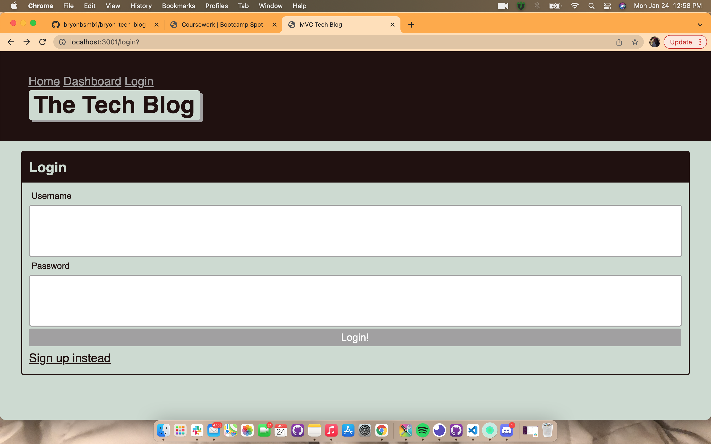

# Tech Blog 
Homework 14

 

# Link to deployed app

[Click](https://bryontechblog.herokuapp.com/login)

# Technologies used:

Node.js, Inquirer, Mysql, Handlebars

# Overview
Develop a site where devs can publish their blog posts and comment on other developers’ posts as well.

# License
MIT
 
# Contact Info
https://github.com/bryonbsmb1
